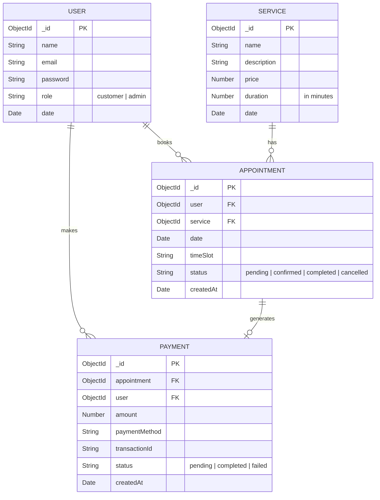

# AutoCare Service Center - MERN Stack Application

AutoCare is a local automobile service center application that provides services such as oil changes, car washing, and vehicle diagnostics. This MERN stack application digitizes the service booking process, simulating a real-world service management workflow with multiple user roles, structured data handling, and an interactive minimalist user interface.

## System Overview

- **Database**: MongoDB (Mongoose schemas for Users, Services, Appointments, Payments)
- **Backend**: Node.js & Express.js
- **Frontend**: React.js (Vite), React Router
- **Styling**: Vanilla CSS with a minimalist, modern approach emphasizing functionality.
- **Authentication**: JWT stored in HTTP-only cookies, verified by Express middleware.

### User Roles
1. **Customer**: Can view available services, book appointments, view service history, and execute a mock payment checkout.
2. **Admin**: Can manage (add/remove) services, and view/update all customer appointments.

---

## Entity Relationship Diagram (ERD)



## How to Run

1. **Backend**:
   ```bash
   cd backend
   npm install
   npm run dev
   ```

2. **Frontend**:
   ```bash
   cd frontend
   npm install
   npm run dev
   ```

3. **Access**:
   The frontend runs on `http://localhost:5173` and communicates with the backend on `http://localhost:5000`.
